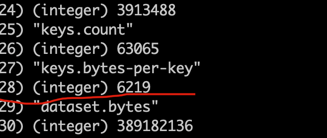

### 使用 redis benchmark 工具, 测试 10 20 50 100 200 1k 5k 字节 value 大小，redis get set 性能

### 统计平均key 的内存占用

###### 63114 个key value的大小为 10 字节

key的平均大小如下：通过命令 memeory stats 可以获取

###### 63091 个key，value大小为 20字节

key的平均大小如下：通过命令 memory stats 可以获取

###### 63092 个 key，value大小为 50 字节

key的平均大小如下：通过命令memory stats 可以获取

###### 63301 个 key，value大小为 100 字节

key的平均大小如下：通过命令memory stats 可以获取

###### 63166 个 key，value大小为 200 字节

key的平均大小如下：通过命令memory stats 可以获取

###### 63187 个 key，value大小为 1k 字节

key的平均大小如下：通过命令memory stats 可以获取

###### 63065 个 key，value大小为 5k 字节

key的平均大小如下：通过命令memory stats 可以获取

